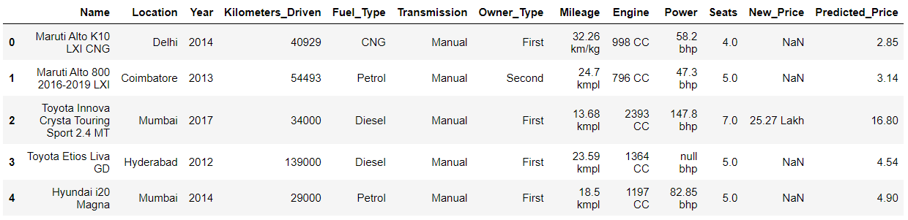

# Used cars prices predictions

## Project description

The goal of the project is to find a model that predicts the used cars prices the most accurately.

In the project, I analyzed data, performed various data filtering and transforming methods (on the features and on the target), used two approches for dealing with unknown data (imputing data vs removing them), two approaches for dealing with outliers (replacing outliers vs removing outliers), and compared many models in order to find the best one.

## Installation

The project uses Python 3.9.12. All Python libraries required to run the code can be found in the `requirements.txt` file and installed in the following way:

    pip install -r requirements.txt

## Datasets

Two cars datasets have been used, both of which come from [Kaggle](https://www.kaggle.com/):
- [cars_train.csv](https://www.kaggle.com/datasets/avikasliwal/used-cars-price-prediction?select=train-data.csv) - used to analyze data and train the models.
- [test-data.csv](https://www.kaggle.com/datasets/avikasliwal/used-cars-price-prediction?select=test-data.csv)  - used to present the models usage and predictions on unknown dataset.

Please use the above links to get familiar with the data. A deeper analysis of the data can be found in `data_analysis.jpynb`.

## Results

The best predictions were achieved by:
- leaving outliers (instead of replacing them),
- imputing missing values with `KNNImputer(n_neighbors=3)`,
- transforming target using `QuantileTransformer(output_distribution='normal')`,
- using an ensemble method - `GradientBoostingRegressor(loss='huber', n_estimators=500)`.

The full approaches and models comparison can be found in `models.jpynb`.

## Usage example

The chosen model and target transformer are saved in `cars_chosen_model.joblib` and `y_transformer.joblib` respectively.

    chosen_model = load('cars_chosen_model.joblib')
    y_transformer = load('y_transformer.joblib')

You can perform predictions, e.g. on the `test-data.csv` dataset, in a following way.

    df_test = pd.read_csv('test-data.csv', index_col=0)
    df_test_with_prices = get_predictions(chosen_model, y_transformer, df_test)
    df_test_with_prices.head()

